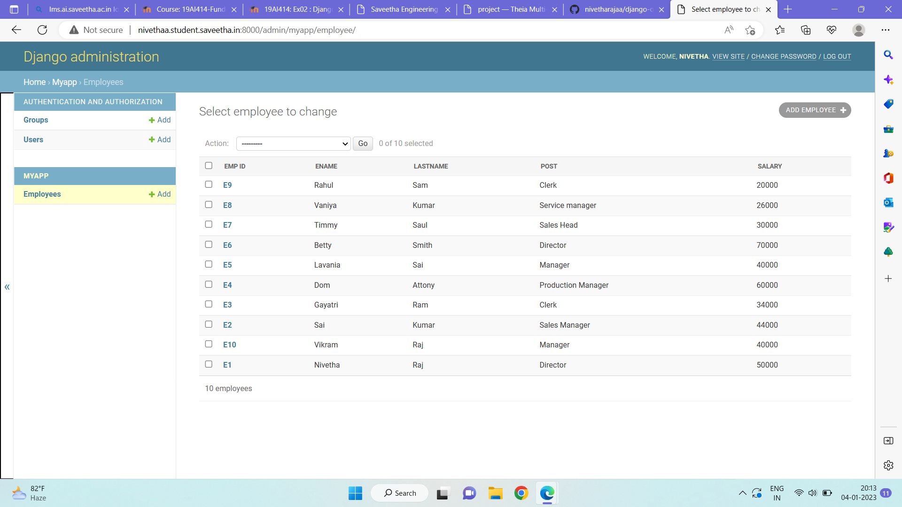
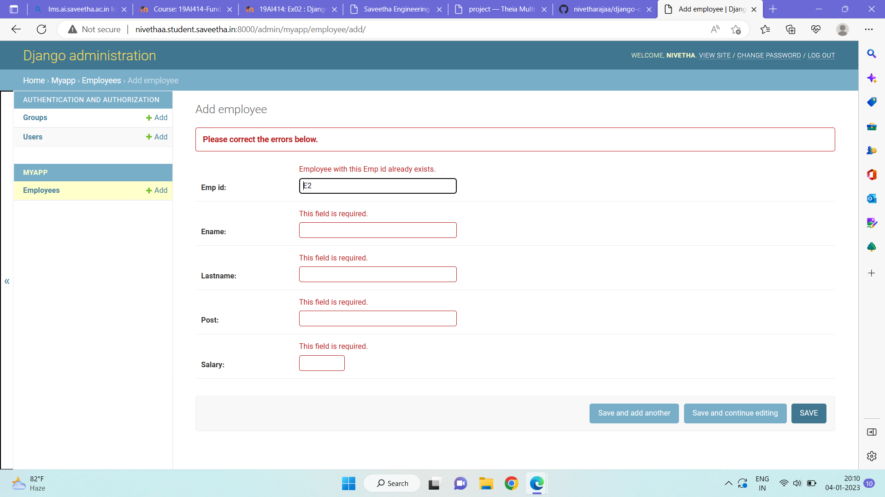

# Django ORM Web Application

## AIM
To develop a Django application to store and retrieve data from a database using Object Relational Mapping(ORM).

## DESIGN STEPS

### STEP 1:

Clone the orm repository and launch django admin.

### STEP 2:

Startapp myapp and migrate and create employee database with the help of models.py and admin.py

### STEP 3:

Then runserver and enter atleast 10 employee records into the database.

## PROGRAM
```
MODELS CODE:

from django.db import models
from django.contrib import admin
# Create your models here.
class Employee(models.Model):
    emp_id=models.CharField(max_length=20,primary_key=True)
    ename=models.CharField(max_length=20)
    lastname=models.CharField(max_length=20)
    post=models.CharField(max_length=20)
    salary=models.IntegerField()
class EmployeeAdmin(admin.ModelAdmin):
    list_display=('emp_id','ename','lastname','post','salary')

ADMIN CODE:

from django.contrib import admin
from .models import Employee,EmployeeAdmin
# Register your models here.
admin.site.register(Employee,EmployeeAdmin)

```

## OUTPUT

### Employee database



### Primary Key verification



## RESULT

Database created successfully
